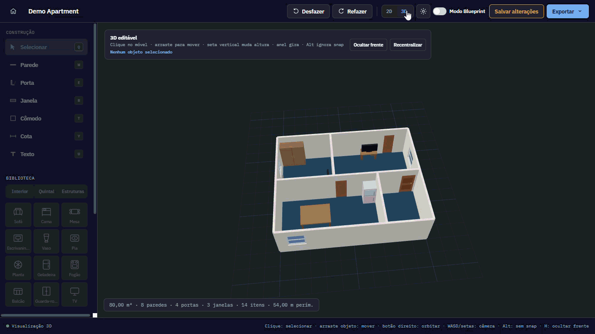

# VisualMaker

Browser-based floor plan editor for creating, editing and visualizing architectural layouts in **2D and 3D**.

[English](#english) · [Português](#português)

<p align="center">
  
</p>

<p align="center">
  <strong>Create in 2D. Visualize and edit in 3D.</strong>
</p>

---

## Preview

<p align="center">
  <a href="https://ink-creator.github.io/VisualMaker/" target="_blank">
    <strong>Open Live Demo</strong>
  </a>
</p>

<table> 
  <tr> 
    <td align="center" width="50%"> 
      <strong>2D Editor</strong><br><br> 
       
    </td> 
    <td align="center" width="50%"> 
      <strong>Blueprint Mode</strong><br><br> 
       
    </td> 
  </tr> 
  <tr> 
    <td align="center" width="50%"> 
      <strong>3D Visualization</strong><br><br> 
       
    </td> 
    <td align="center" width="50%"> 
      <strong>3D Editing</strong><br><br> 
       
    </td> 
  </tr> 
</table>

---

# English

## About

**VisualMaker** is a browser-based floor plan editor designed to make the creation and visualization of architectural layouts simple and interactive.

Projects are created in a 2D editor and can be instantly transformed into a navigable 3D environment.

The application runs directly in the browser and does not require a backend or external 3D software.

---

## Features

### 2D Floor Plan Editor

Create and edit layouts using:

- Walls
- Doors
- Windows
- Rooms
- Dimensions
- Text
- Furniture
- Outdoor objects
- Gates
- Structural elements

Elements can be positioned and resized using precise measurements.

### Furniture and Object Library

VisualMaker includes objects for different areas of a project, such as:

- Sofa
- Bed
- Table
- Desk
- Wardrobe
- TV
- Refrigerator
- Stove
- Counter
- Sink
- Toilet
- Plants
- Trees
- Car
- Pool
- Barbecue
- Pergola
- Gates

Objects are represented in both the 2D editor and the 3D environment.

### Colors and Materials

Rooms and objects support different colors and materials.

Available floor styles include:

- Solid colors
- Wood
- Ceramic
- Concrete
- Grass

Color presets are also compatible with light and dark themes.

---

## Blueprint Mode

The floor plan can be displayed using a technical blueprint-style visualization.

It includes:

- Blue background
- Architectural grid
- Measurements
- High-contrast lines

This mode can also be exported as an image.

---

## 3D Visualization

The floor plan created in the 2D editor can be transformed directly into an interactive 3D environment.

The 3D representation includes:

- Walls with height and thickness
- Floors
- Door openings
- Window openings
- Furniture
- Structural elements
- Gates
- Materials
- Colors
- Lighting
- Perspective camera

### Camera Controls

| Control | Action |
| --- | --- |
| `W` / `↑` | Move forward |
| `S` / `↓` | Move backward |
| `A` / `←` | Move left |
| `D` / `→` | Move right |
| `Shift` | Move faster |
| Mouse drag | Rotate camera |
| Mouse wheel | Zoom |

Front walls can also be temporarily hidden to make interior spaces easier to inspect.

---

## 3D Editing

Furniture and other objects can be adjusted directly from the 3D environment.

You can:

- Select objects
- Move objects across the floor
- Change elevation
- Rotate objects
- Edit exact X and Y coordinates
- Edit exact rotation
- Edit exact elevation
- Snap objects to walls
- Snap objects into corners
- Return objects to floor level
- Duplicate objects
- Mirror objects

Holding `Alt` while moving an object temporarily disables automatic snapping.

Structural changes such as creating or modifying walls remain in the 2D editor to keep the project geometry consistent.

---

## Saving Projects

Projects can be saved directly in the browser.

Saved data includes:

- Floor plan elements
- Dimensions
- Colors
- Materials
- Object positions
- Object rotations
- Object elevations
- 3D camera position
- Camera orientation
- Current 2D or 3D view
- Front-wall visibility

When a project is opened again, its 3D environment is reconstructed automatically from the saved floor plan.

---

## Export

VisualMaker supports multiple export formats for both 2D and 3D projects.

### 2D Export

Floor plans can be exported as:

- PNG
- SVG
- Light theme
- Dark theme
- Blueprint

### Interactive 3D HTML

The complete 3D environment can be exported as a standalone `.html` file.

The exported viewer:

- Contains the complete 3D scene
- Opens directly in a modern browser
- Works offline
- Requires no installation
- Requires no server
- Supports camera rotation
- Supports camera movement
- Supports zoom

This makes it possible to share an interactive 3D project using only a single HTML file.

### OBJ + MTL Export

The 3D model can also be exported using:

- `.obj` — model geometry
- `.mtl` — material information

These files can be imported into compatible 3D software for further visualization, editing or integration into other workflows.

---

## How to Run

No installation is required.

Clone the repository:

```bash
git clone https://github.com/ink-creator/VisualMaker.git
```

Or download the repository as a ZIP.

Then open:

```text
index.html
```

A modern browser is recommended, such as:

- Google Chrome
- Microsoft Edge
- Mozilla Firefox

---

## Technologies

VisualMaker was built using:

- HTML
- CSS
- JavaScript
- SVG
- WebGL
- Browser storage

No backend is required.

---

## Project Structure

```text
VisualMaker/
├── assets/
│   └── screenshots/
│       ├── 2d-3d.gif
│       ├── 2d-editor.png
│       ├── 2d-blueprint.png
│       ├── 3d-view.png
│       └── 3d-editor.png
├── app.js
├── elements.js
├── geometry.js
├── index.html
├── render.js
├── storage.js
├── styles.css
├── view3d.js
├── LICENSE
└── README.md
```

---

## Current Status

The first functional version already supports the complete workflow:

```text
Create floor plan
       ↓
Edit in 2D
       ↓
Visualize in 3D
       ↓
Edit objects in 3D
       ↓
Save project
       ↓
Export 2D / 3D
```

Future features and improvements can be introduced gradually in new versions.

---

# Português

## Sobre

O **VisualMaker** é um editor de plantas baixas executado diretamente no navegador, criado para facilitar a criação e visualização de projetos arquitetônicos em **2D e 3D**.

Os projetos são criados no editor 2D e podem ser transformados imediatamente em um ambiente 3D navegável.

A aplicação funciona diretamente no navegador e não precisa de backend ou programa 3D externo.

---

## Funcionalidades

### Editor de Planta Baixa 2D

Crie e edite plantas utilizando:

- Paredes
- Portas
- Janelas
- Cômodos
- Cotas
- Textos
- Móveis
- Objetos externos
- Portões
- Elementos estruturais

Os elementos podem ser posicionados e redimensionados utilizando medidas precisas.

### Biblioteca de Móveis e Objetos

O VisualMaker possui objetos para diferentes áreas do projeto, incluindo:

- Sofá
- Cama
- Mesa
- Escrivaninha
- Guarda-roupa
- TV
- Geladeira
- Fogão
- Balcão
- Pia
- Vaso sanitário
- Plantas
- Árvores
- Carro
- Piscina
- Churrasqueira
- Pergolado
- Portões

Os objetos possuem representação tanto no editor 2D quanto no ambiente 3D.

### Cores e Materiais

Cômodos e objetos podem utilizar diferentes cores e materiais.

Entre os estilos de piso disponíveis estão:

- Cores sólidas
- Madeira
- Cerâmica
- Concreto
- Grama

As paletas também possuem suporte aos temas claro e escuro.

---

## Modo Blueprint

A planta pode ser exibida utilizando uma visualização técnica no estilo blueprint.

Ela inclui:

- Fundo azul
- Grade arquitetônica
- Medidas
- Linhas de alto contraste

O modo Blueprint também pode ser exportado como imagem.

---

## Visualização 3D

A planta criada no editor 2D pode ser transformada diretamente em um ambiente 3D interativo.

A representação 3D inclui:

- Paredes com altura e espessura
- Pisos
- Aberturas de portas
- Aberturas de janelas
- Móveis
- Elementos estruturais
- Portões
- Materiais
- Cores
- Iluminação
- Câmera em perspectiva

### Controles da Câmera

| Controle | Ação |
| --- | --- |
| `W` / `↑` | Avançar |
| `S` / `↓` | Recuar |
| `A` / `←` | Mover para esquerda |
| `D` / `→` | Mover para direita |
| `Shift` | Movimento rápido |
| Arrastar mouse | Girar câmera |
| Scroll | Zoom |

As paredes frontais também podem ser ocultadas temporariamente para facilitar a visualização dos ambientes internos.

---

## Edição em 3D

Móveis e outros objetos podem ser ajustados diretamente pelo ambiente 3D.

É possível:

- Selecionar objetos
- Movê-los pelo piso
- Alterar a elevação
- Rotacionar
- Editar coordenadas X e Y
- Definir rotação exata
- Definir elevação exata
- Encaixar objetos em paredes
- Encaixar objetos em cantos
- Reposicionar objetos no chão
- Duplicar objetos
- Espelhar objetos

Ao segurar `Alt` durante a movimentação, os encaixes automáticos são temporariamente desativados.

Alterações estruturais, como criação ou modificação de paredes, continuam sendo realizadas no editor 2D para manter a geometria do projeto consistente.

---

## Salvamento de Projetos

Os projetos podem ser salvos diretamente no navegador.

O projeto salvo inclui:

- Elementos da planta
- Medidas
- Cores
- Materiais
- Posição dos objetos
- Rotação dos objetos
- Elevação dos objetos
- Posição da câmera 3D
- Orientação da câmera
- Visualização atual em 2D ou 3D
- Configuração das paredes frontais

Ao abrir o projeto novamente, o ambiente 3D é reconstruído automaticamente a partir da planta salva.

---

## Exportação

O VisualMaker possui diferentes opções de exportação para projetos 2D e 3D.

### Exportação 2D

A planta pode ser exportada em:

- PNG
- SVG
- Tema claro
- Tema escuro
- Blueprint

### HTML 3D Interativo

O ambiente 3D completo pode ser exportado como um único arquivo `.html`.

O visualizador exportado:

- Contém toda a cena 3D
- Abre diretamente em navegadores modernos
- Funciona offline
- Não precisa de instalação
- Não precisa de servidor
- Permite girar a câmera
- Permite movimentar a câmera
- Permite utilizar zoom

Isso permite compartilhar um projeto 3D interativo utilizando apenas um arquivo HTML.

### Exportação OBJ + MTL

O modelo 3D também pode ser exportado utilizando:

- `.obj` — geometria do modelo
- `.mtl` — informações dos materiais

Esses arquivos podem ser utilizados em softwares 3D compatíveis para visualização, edição ou integração com outros projetos.

---

## Como Executar

Nenhuma instalação é necessária.

Clone o repositório:

```bash
git clone https://github.com/ink-creator/VisualMaker.git
```

Ou baixe o repositório como ZIP.

Depois abra:

```text
index.html
```

É recomendado utilizar um navegador moderno, como:

- Google Chrome
- Microsoft Edge
- Mozilla Firefox

---

## Tecnologias

O VisualMaker foi desenvolvido utilizando:

- HTML
- CSS
- JavaScript
- SVG
- WebGL
- Armazenamento do navegador

O projeto não depende de backend.

---

## Estrutura do Projeto

```text
VisualMaker/
├── assets/
│   └── screenshots/
│       ├── 2d-3d.gif
│       ├── 2d-editor.png
│       ├── 2d-blueprint.png
│       ├── 3d-view.png
│       └── 3d-editor.png
├── app.js
├── elements.js
├── geometry.js
├── index.html
├── render.js
├── storage.js
├── styles.css
├── view3d.js
├── LICENSE
└── README.md
```

---

## Estado Atual

A primeira versão funcional já permite realizar o fluxo completo:

```text
Criar planta
      ↓
Editar em 2D
      ↓
Visualizar em 3D
      ↓
Editar objetos em 3D
      ↓
Salvar projeto
      ↓
Exportar em 2D / 3D
```

Novas funcionalidades e melhorias podem ser adicionadas gradualmente em versões futuras.

---

## License / Licença

This project is available under the **MIT License**.

Este projeto está disponível sob a **Licença MIT**.

See / Consulte [LICENSE](LICENSE).