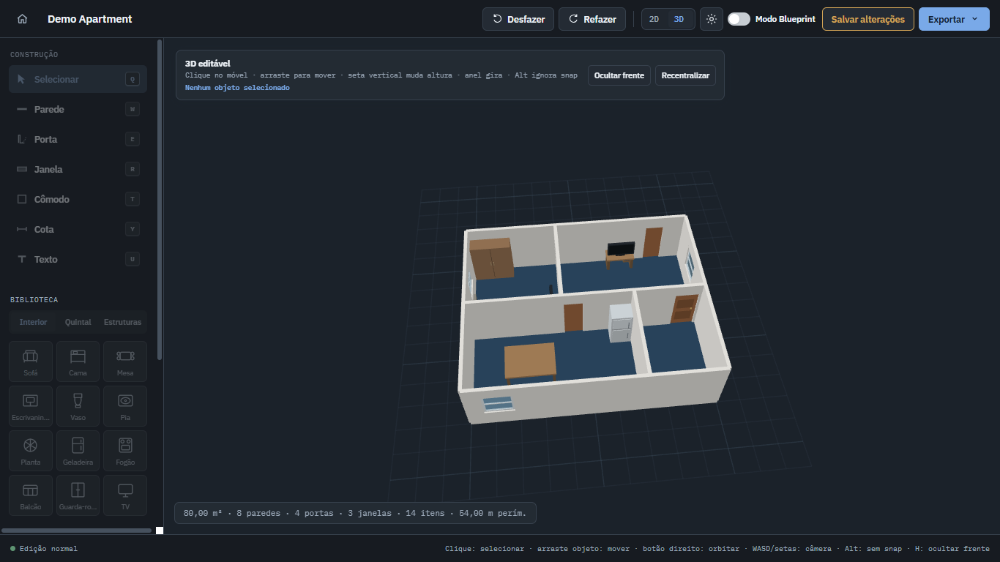
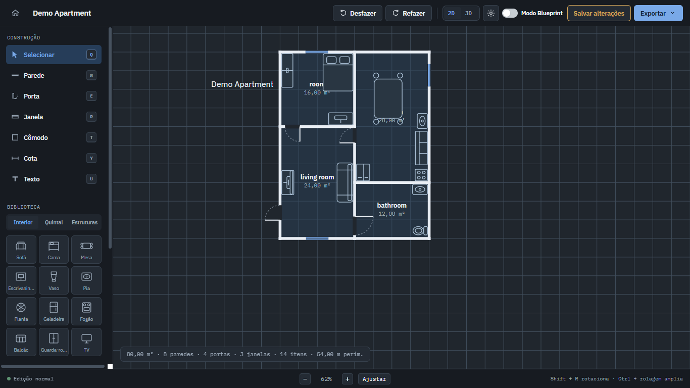
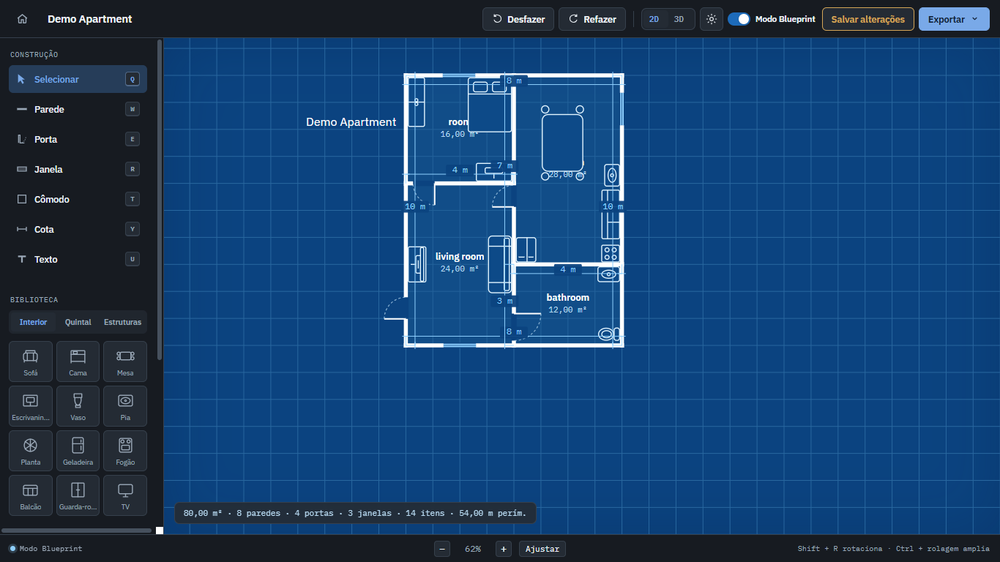
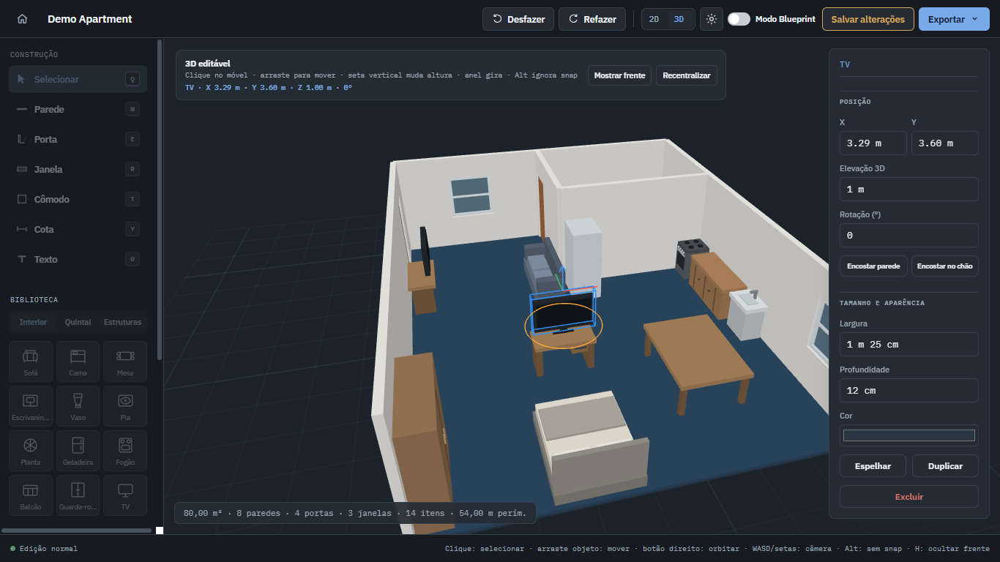

# VisualMaker

Browser-based floor plan editor for creating, editing and visualizing architectural layouts in **2D and 3D**.

No installation, backend or external 3D software required.

[English](#english) · [Português](#português)

  

## Preview

<table>
  <tr>
    <td align="center" width="50%">
      <strong>2D Editor</strong>  
      
    </td>
    <td align="center" width="50%">
      <strong>Blueprint Mode</strong>  
      
    </td>
  </tr>
  <tr>
    <td align="center" width="50%">
      <strong>3D Visualization</strong>  
      
    </td>
    <td align="center" width="50%">
      <strong>3D Editing</strong>  
      
    </td>
  </tr>
</table>

---

# English

## About

**VisualMaker** is a browser-based floor plan editor designed to make the creation and visualization of architectural layouts simple and interactive.

A project can be created in the 2D editor and immediately visualized as a navigable 3D environment.

The application runs directly in the browser and does not require a backend, installation or external 3D software.

## Features

### 2D floor plan editor

Create and edit floor plans using:

- Walls
- Doors
- Windows
- Rooms
- Dimensions
- Text
- Furniture
- Outdoor objects
- Gates
- Structural elements

Elements can be positioned and resized using exact measurements.

### Furniture and object library

VisualMaker includes objects for different areas of a project, including:

- Sofa
- Bed
- Table
- Desk
- Wardrobe
- TV
- Refrigerator
- Stove
- Counter
- Sink
- Toilet
- Plants
- Trees
- Car
- Pool
- Barbecue
- Pergola
- Gates

Objects are represented in both the 2D editor and the 3D environment.

### Colors and materials

Rooms and objects support different colors and materials.

Floor materials include:

- Solid colors
- Wood
- Ceramic
- Concrete
- Grass

Color presets are available for both light and dark themes.

### Blueprint mode

The floor plan can be displayed using a technical blueprint-style visualization with:

- Blue background
- Architectural grid
- Measurements
- High-contrast lines

## 3D visualization

The 2D floor plan can be converted directly into an interactive 3D environment.

The 3D representation includes:

- Walls with height and thickness
- Floors
- Door openings
- Window openings
- Furniture
- Structural elements
- Gates
- Materials
- Colors
- Lighting
- Perspective camera

### Camera controls

| Control | Action |
| --- | --- |
| `W` / `↑` | Move forward |
| `S` / `↓` | Move backward |
| `A` / `←` | Move left |
| `D` / `→` | Move right |
| `Shift` | Move faster |
| Mouse drag | Rotate camera |
| Mouse wheel | Zoom |

Front walls can also be temporarily hidden to make interior spaces easier to inspect.

## 3D editing

Furniture and objects can be adjusted directly from the 3D view.

You can:

- Select objects
- Move objects across the floor
- Change elevation
- Rotate objects
- Edit exact X and Y coordinates
- Edit exact rotation
- Edit exact elevation
- Snap objects to walls
- Snap objects into corners
- Return objects to floor level
- Duplicate objects
- Mirror objects

Holding `Alt` while moving an object temporarily disables automatic snapping.

Structural changes such as creating or modifying walls remain in the 2D editor to keep the floor plan geometry consistent.

## Saving projects

Projects can be saved directly in the browser.

Saved data includes:

- Floor plan elements
- Dimensions
- Colors
- Materials
- Object positions
- Object rotations
- Object elevations
- 3D camera position
- Camera orientation
- Current 2D or 3D view
- Front-wall visibility

When a project is opened again, its 3D environment is automatically reconstructed from the saved floor plan.

## Export

### 2D export

Floor plans can be exported as:

- PNG
- SVG
- Light theme
- Dark theme
- Blueprint

### Interactive 3D HTML

The complete 3D project can also be exported as a standalone `.html` file.

The exported viewer:

- Contains the complete 3D environment
- Opens directly in a modern browser
- Works offline
- Requires no installation
- Requires no server
- Supports camera rotation
- Supports camera movement
- Supports zoom

This makes it possible to share an interactive 3D project using only a single HTML file.

## How to run

No installation is required.

Download or clone the repository:

    git clone https://github.com/ink-creator/VisualMaker.git

Keep the project files together and open:

    index.html

A modern browser with WebGL support is recommended, such as Chrome, Edge or Firefox.

## Technologies

VisualMaker was built with:

- HTML
- CSS
- JavaScript
- SVG for the 2D editor
- Canvas / WebGL for 3D visualization
- Browser storage for project persistence

No backend is required.

## Project structure

    VisualMaker/
    ├── assets/
    │   └── screenshots/
    │       ├── 2d-editor.png
    │       ├── 2d-blueprint.png
    │       ├── 3d-view.png
    │       └── 3d-editor.png
    ├── app.js
    ├── elements.js
    ├── geometry.js
    ├── index.html
    ├── render.js
    ├── storage.js
    ├── styles.css
    ├── view3d.js
    ├── LICENSE
    └── README.md

## Current status

The first functional version already supports the complete workflow:

    Create floor plan
           ↓
      Edit in 2D
           ↓
     View in 3D
           ↓
     Edit objects
           ↓
      Save project
           ↓
    Export 2D / 3D

Future improvements can be introduced gradually in new versions.

---

# Português

## Sobre

O **VisualMaker** é um editor de plantas baixas executado diretamente no navegador, criado para facilitar a montagem e visualização de projetos arquitetônicos em **2D e 3D**.

Uma planta pode ser criada no editor 2D e visualizada imediatamente como um ambiente 3D navegável.

A aplicação funciona diretamente no navegador e não precisa de backend, instalação ou programa 3D externo.

## Funcionalidades

### Editor de planta baixa 2D

Crie e edite plantas utilizando:

- Paredes
- Portas
- Janelas
- Cômodos
- Cotas
- Textos
- Móveis
- Objetos externos
- Portões
- Elementos estruturais

Os elementos podem ser posicionados e redimensionados utilizando medidas exatas.

### Biblioteca de móveis e objetos

O VisualMaker possui objetos para diferentes áreas do projeto, incluindo:

- Sofá
- Cama
- Mesa
- Escrivaninha
- Guarda-roupa
- TV
- Geladeira
- Fogão
- Balcão
- Pia
- Vaso sanitário
- Plantas
- Árvores
- Carro
- Piscina
- Churrasqueira
- Pergolado
- Portões

Os objetos possuem representação tanto no editor 2D quanto no ambiente 3D.

### Cores e materiais

Cômodos e objetos podem utilizar diferentes cores e materiais.

Entre os materiais de piso disponíveis estão:

- Cores sólidas
- Madeira
- Cerâmica
- Concreto
- Grama

Também existem paletas prontas compatíveis com os temas claro e escuro.

### Modo Blueprint

A planta pode ser exibida em uma visualização técnica no estilo blueprint, utilizando:

- Fundo azul
- Grade arquitetônica
- Medidas
- Linhas de alto contraste

## Visualização 3D

A planta criada no editor 2D pode ser convertida diretamente para um ambiente 3D interativo.

A representação 3D inclui:

- Paredes com altura e espessura
- Pisos
- Aberturas de portas
- Aberturas de janelas
- Móveis
- Elementos estruturais
- Portões
- Materiais
- Cores
- Iluminação
- Câmera em perspectiva

### Controles da câmera

| Controle | Ação |
| --- | --- |
| `W` / `↑` | Avançar |
| `S` / `↓` | Recuar |
| `A` / `←` | Mover para esquerda |
| `D` / `→` | Mover para direita |
| `Shift` | Movimento rápido |
| Arrastar mouse | Girar câmera |
| Scroll | Zoom |

As paredes frontais também podem ser ocultadas temporariamente para facilitar a visualização dos ambientes internos.

## Edição em 3D

Móveis e objetos podem ser ajustados diretamente pela visualização 3D.

É possível:

- Selecionar objetos
- Movê-los pelo piso
- Alterar a elevação
- Rotacionar
- Editar coordenadas X e Y
- Definir rotação exata
- Definir elevação exata
- Encaixar objetos em paredes
- Encaixar objetos em cantos
- Reposicionar objetos no chão
- Duplicar objetos
- Espelhar objetos

Ao segurar `Alt` durante a movimentação, os encaixes automáticos são temporariamente desativados.

Alterações estruturais, como criação e modificação de paredes, continuam sendo realizadas no editor 2D para manter a geometria da planta consistente.

## Salvamento de projetos

Os projetos podem ser salvos diretamente no navegador.

O projeto salvo inclui:

- Elementos da planta
- Medidas
- Cores
- Materiais
- Posição dos objetos
- Rotação dos objetos
- Elevação dos objetos
- Posição da câmera 3D
- Orientação da câmera
- Visualização atual em 2D ou 3D
- Configuração das paredes frontais

Ao abrir o projeto novamente, o ambiente 3D é reconstruído automaticamente a partir da planta salva.

## Exportação

### Exportação 2D

A planta pode ser exportada em:

- PNG
- SVG
- Tema claro
- Tema escuro
- Blueprint

### HTML 3D interativo

O projeto completo também pode ser exportado como um único arquivo `.html`.

O arquivo exportado:

- Contém o ambiente 3D
- Abre diretamente em navegadores modernos
- Funciona offline
- Não precisa de instalação
- Não precisa de servidor
- Permite girar a câmera
- Permite movimentar a câmera
- Permite utilizar zoom

Isso permite compartilhar uma planta 3D interativa utilizando apenas um arquivo HTML.

## Como executar

Nenhuma instalação é necessária.

Baixe o projeto ou clone o repositório:

    git clone https://github.com/ink-creator/VisualMaker.git

Mantenha os arquivos do projeto juntos e abra:

    index.html

É recomendado utilizar um navegador moderno com suporte a WebGL, como Chrome, Edge ou Firefox.

## Tecnologias

O VisualMaker foi desenvolvido utilizando:

- HTML
- CSS
- JavaScript
- SVG para o editor 2D
- Canvas / WebGL para a visualização 3D
- Armazenamento do navegador para salvar os projetos

O projeto não depende de backend.

## Estrutura do projeto

    VisualMaker/
    ├── assets/
    │   └── screenshots/
    │       ├── 2d-editor.png
    │       ├── 2d-blueprint.png
    │       ├── 3d-view.png
    │       └── 3d-editor.png
    ├── app.js
    ├── elements.js
    ├── geometry.js
    ├── index.html
    ├── render.js
    ├── storage.js
    ├── styles.css
    ├── view3d.js
    ├── LICENSE
    └── README.md

## Estado atual

A primeira versão funcional já permite realizar o fluxo completo:

    Criar planta
         ↓
    Editar em 2D
         ↓
    Visualizar em 3D
         ↓
    Editar objetos
         ↓
    Salvar projeto
         ↓
    Exportar em 2D / 3D

Novas funcionalidades e melhorias podem ser adicionadas gradualmente em versões futuras.

---

## License / Licença

This project is available under the **MIT License**.

Este projeto está disponível sob a **Licença MIT**.

See / Consulte [LICENSE](LICENSE).